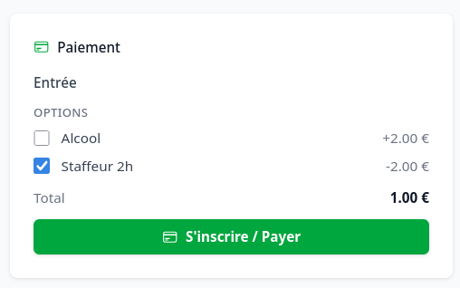
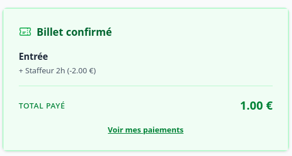

# Mes billets et paiements

Certains événements sont payants (billetterie via HelloAsso). La page **Paiements** de
l'accès rapide regroupe vos achats.

## Payer un événement

Lorsqu'un événement propose une billetterie, un bouton de paiement apparaît sur sa page : il
ne reste plus qu'à prendre sa place.

Vous pouvez choisir d'éventuelles **options** (suppléments), puis vous êtes redirigé vers le
paiement sécurisé HelloAsso, où vos **nom, prénom et e-mail sont déjà pré-remplis** : il ne
reste plus qu'à régler.

## Retrouver vos billets

1. Ouvrez **Paiements** depuis l'accès rapide.
2. Consultez la liste de vos paiements et de leur statut.
3. Le jour de l'événement, présentez le justificatif demandé à l'entrée pour validation.

## En cas de problème

- Un paiement n'apparaît pas comme réglé ? Patientez quelques minutes : la confirmation
  HelloAsso peut prendre un peu de temps, puis le statut se met à jour.
- Pour un remboursement ou une question sur un billet, contactez l'organisation
  organisatrice.

> Cette page ne montre que **vos propres** paiements.
