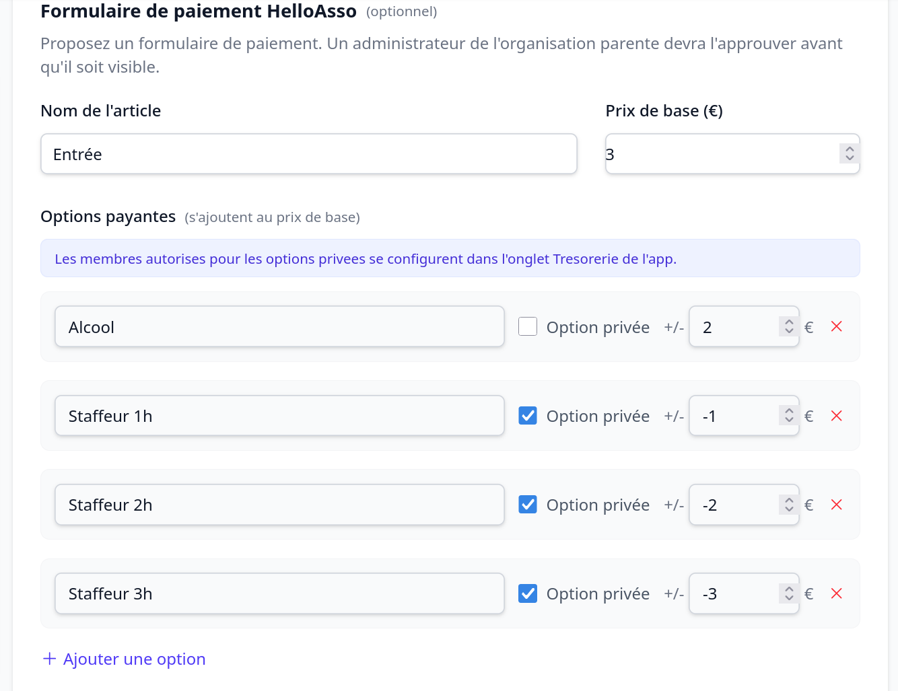
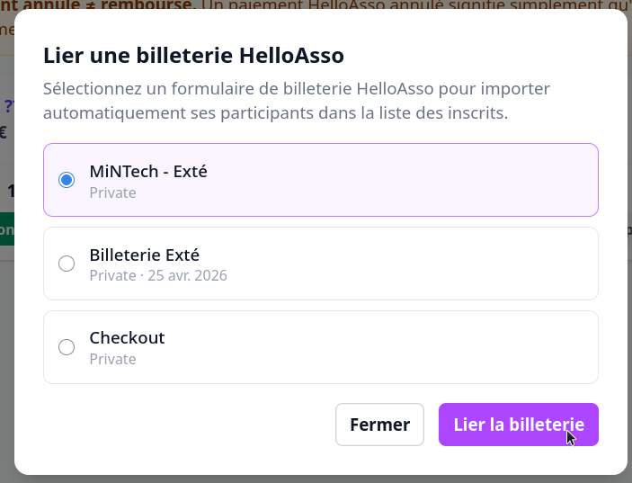

# Proposer un formulaire de paiement

Un **formulaire de paiement** attache une billetterie à un événement. Sa proposition est
réservée aux personnes ayant le droit **trésorerie** dans l'organisation de l'événement.

## Créer le formulaire

Vous pouvez créer une billetterie aussi facilement que vous créez un événement, directement
dans les détails de l'événement.

1. Sur la page de l'événement, ajoutez un **formulaire de paiement**.
2. Définissez le **libellé** et le **montant** de base.
3. Ajoutez éventuellement des **options** (suppléments) ; une option peut être **privée**,
   c'est-à-dire réservée à certaines personnes (par exemple une liste de **staffeurs**).

Aucun appel à HelloAsso n'est effectué tant que le formulaire n'est pas approuvé.

## Circuit d'approbation

- Le formulaire est **proposé** par l'organisation de l'événement (organisation
  requérante).
- Il doit être **approuvé** par la trésorerie de l'**organisation parente** (organisation
  approbatrice) avant publication. Un membre trésorerie de l'organisation parente
  l'approuve ou le refuse ([[tableau-de-bord-tresorerie]]).
- Un formulaire **refusé** ne peut pas être réédité ; un formulaire **en attente** peut
  être modifié ou annulé.

## Pendant et après l'événement

- Vous pouvez **ouvrir / fermer** les paiements, et **vérifier le statut** des paiements
  en attente (synchronisation avec HelloAsso).
- Vous pouvez ajouter des **entrées manuelles** (espèces, chèque…) sans passer par
  HelloAsso, et **importer les participants** d'une billetterie HelloAsso existante.

## Le cas des extés

Pour les **extés** (personnes hors école), pas de panique : créez une billetterie normale
juste pour eux (comme d'habitude) et envoyez-la-leur. Vous pouvez ensuite **lier** cette
billetterie à l'événement pour que ses participants apparaissent dans la liste de
validation — comme ça, pas besoin de chercher à plusieurs endroits.

> Le contrôle des billets le jour J est décrit dans [[valider-les-billets]].
