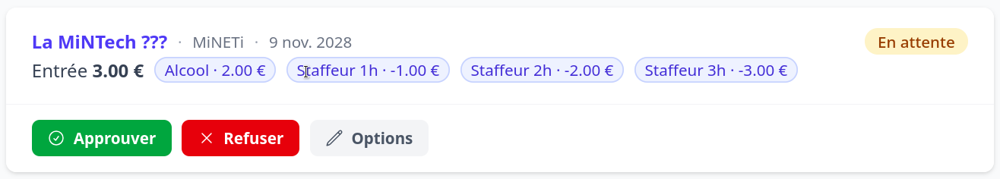

# Le tableau de bord trésorerie

La page [**Trésorerie**](/payments) (raccourci aussi affiché dans la barre latérale si
vous gérez la trésorerie d'au moins une organisation) centralise le suivi des paiements.

## Ce que vous y trouvez

- Tous les **formulaires de paiement** des organisations où vous avez le droit trésorerie.
- Les **demandes en attente** d'approbation pour les organisations dont vous êtes
  l'organisation parente : vous pouvez les **approuver** ou les **refuser**
  ([[proposer-formulaire-paiement]]). Lors de la validation, vous pouvez aussi renseigner la
  liste des **staffeurs** qui bénéficieront des options privées.
- Le suivi des **entrées** (paiements) par formulaire.

## Exports

Vous pouvez **exporter** au format tableur (ODS) :

- les entrées d'un formulaire de paiement donné ;
- l'ensemble des paiements au niveau d'une organisation.

L'export contient assez d'informations pour faire le lien entre les entrées de l'export
HelloAsso et celles de Calend'INT — notamment le **nom** de la personne, son **e-mail** et
l'**ID de la transaction HelloAsso**.

## Suivi des paiements

Vous pouvez relancer la **vérification du statut** auprès de HelloAsso pour marquer comme
réglés les paiements complétés depuis la dernière synchronisation.

> Toutes ces actions nécessitent le droit trésorerie. La liste ci-dessus indique les
> organisations concernées. Pour le contrôle à l'entrée, voir [[valider-les-billets]].
