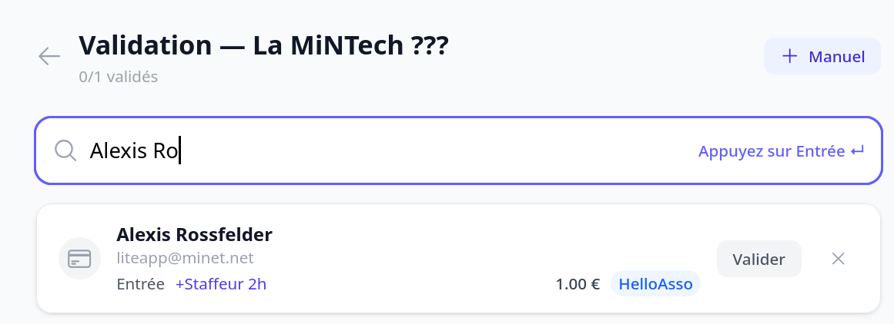
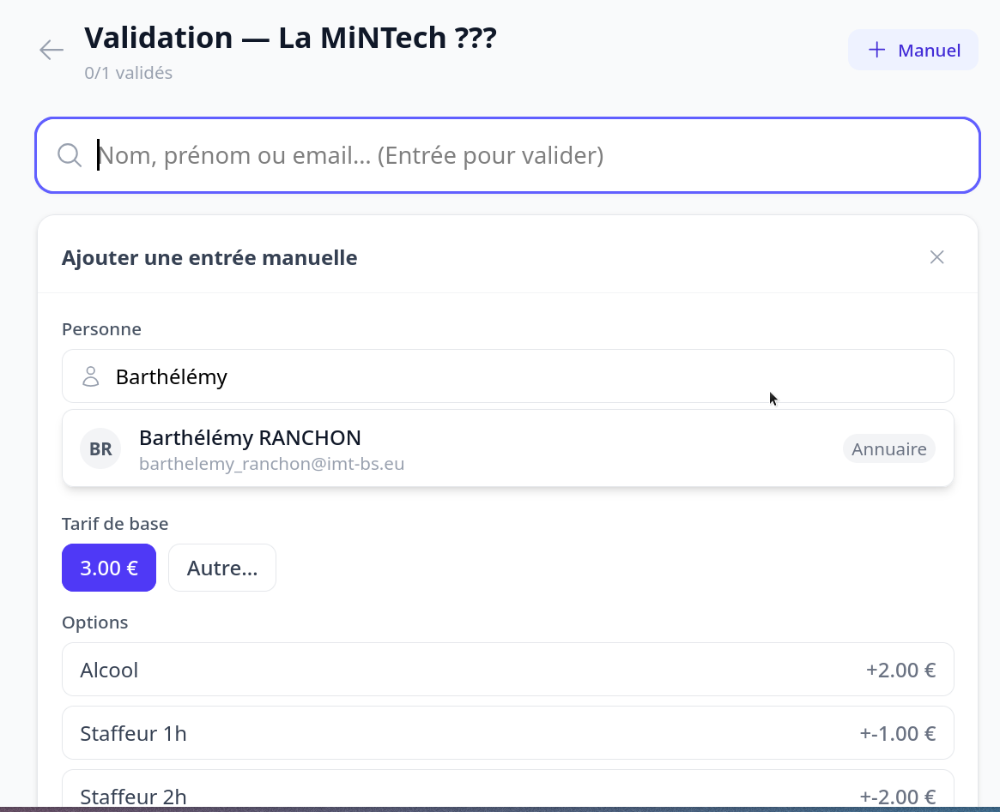

# Valider les billets à l'entrée

Le jour de l'événement, les personnes ayant le droit **trésorerie** (ou les
administrateurs de l'organisation) peuvent contrôler les billets.

## Lancer la validation

1. Ouvrez la page de l'événement concerné.
2. Accédez à l'écran de **validation** (`/events/<id>/validation`).
3. Recherchez un participant dans la liste, ou utilisez la saisie pour le retrouver.

À l'entrée, il suffit de **chercher le début du nom** de la personne pour valider son
entrée si elle a déjà payé.

## Actions possibles

- **Valider** une entrée (et la dévalider si nécessaire) : l'état de validation se
  bascule.
- **Annuler** une entrée : elle est masquée de la vue de validation.
- Ajouter une **entrée manuelle** pour un participant qui paie sur place (espèces,
  chèque…).
- **Importer** les participants depuis une billetterie HelloAsso liée.

Chaque validation enregistre **qui** a validé et **quand**.

## Faire payer sur place

Si la personne n'a pas encore payé, c'est très simple : appuyez sur **Entrée** quand il n'y
a pas de résultat de recherche pour ouvrir la boîte d'**ajout manuel**.

Vous pouvez alors chercher la personne dans le **trombinoscope** de l'école ou sur
Calend'INT (si elle s'est déjà connectée), et choisir les options de paiement adaptées :
facile de vérifier si quelqu'un est un.e exté ou non.

## Conseils

- Prévoyez une connexion réseau fiable sur place.
- Plusieurs personnes habilitées peuvent valider en parallèle.

> Cette fonctionnalité nécessite le droit trésorerie (ou le rôle administrateur). La liste
> ci-dessus indique les organisations concernées.
